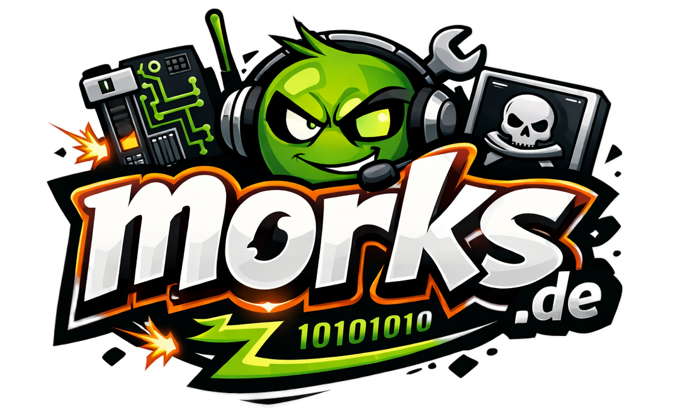

<div align="center">



### `> michael j. plaschke // morks.de`

[](https://git.io/typing-svg)

</div>

---

<div align="center">

## `whoami`

</div>

```bash
$ cat /etc/michael.conf

NAME="Michael J. Plaschke"
ALIAS="morks"
LOCATION="Aurich, Ostfriesland 🌊"
ROLE="Multi-Cloud & Agentic AI Infrastructure Architect"
EMPLOYER="Accenture"
FOCUS=["Cloud Governance", "Kubernetes", "OpenStack", "MeshStack/CMP", "Agentic AI", "DevSecOps"]
STATUS="Building things that shouldn't exist yet."
```

---

<div align="center">

## `./stack`

</div>

<div align="center">


</div>

---

<div align="center">

## `./build` — Tech Projects

</div>

| Project | Status | Description |
|---|---|---|
| 🤖 **Agentic OS** | `[active]` | Autonomes OS-Framework für AI-Agenten — Infrastructure, die selbst denkt |
| 🏨 **StayOps** | `[active]` | Operations-Plattform für Ferienvermietung — alles automatisiert |
| 📒 **StayLedger** | `[active]` | Buchführung & Finanzen für Vermieter — kein Excel mehr |
| 📱 **StayMobile** | `[active]` | Mobile App für Gäste & Hosts der Nordsicht-Properties |
| 🧠 **SmartStay** | `[active]` | AI-gestützte Gast-Experience & Automatisierung |
| 🏗️ **Architecture as Code** | `[active]` | Cloud-Architektur deklarativ — Infrastruktur wie Quellcode |

---

<div align="center">

## `ventures` — Eigene Projekte & Unternehmen

</div>

<table>
<tr>
<td width="50%" valign="top">

### 🌅 [Nordsicht Lindenhof](https://nordsicht.com)
**Ferienhof in Ostfriesland**

> Gastgeber mit Herzblut. Mel & Micha bewirtschaften einen echten Hof am Meer — Urlaub wie er sein sollte.

`#Ferienvermietung` `#Ostfriesland` `#Landleben`

</td>
<td width="50%" valign="top">

### 💻 [Nordsicht-IT](https://nordsicht-it.de)
**IT-Services für Ferienwohnungen**

> Was passiert wenn ein Cloud-Architekt selbst Vermieter wird? Er baut seine eigene Hospitality-IT-Infrastruktur.

`#SaaS` `#HospitalityTech` `#Automatisierung`

</td>
</tr>
<tr>
<td width="50%" valign="top">

### 🎡 [Nordsicht-Events](https://nordsicht-events.de)
**Events in Ostfriesland**

> Von Leuchtturm bis Riesenrad — Events die man in der Steppe zwischen Nord- und Ostsee so nicht erwartet.

`#Events` `#Ostfriesland` `#Community`

</td>
<td width="50%" valign="top">

### 🍺 [NordWarft Bar](https://nordwarft.de)
**Bar in Aurich**

> Kein Craft Beer Hipster-Quatsch. Einfach eine gute Bar.

`#Bar` `#Aurich` `#NordWarft`

</td>
</tr>
<tr>
<td colspan="2">

### ₿ [21map.de](https://21map.de)
**Bitcoin-Akzeptanzstellen-Finder**

> Wo kann ich in Deutschland mit Bitcoin bezahlen? 21map zeigt es dir — interaktiv, aktuell, community-driven.

`#Bitcoin` `#Lightning` `#OpenSource` `#Maps`

</td>
</tr>
</table>

---

<div align="center">

## `irl` — Wenn nicht am Terminal

</div>

```
> hobbies --list

[✓] Sportboot              // Nordsee > Büro
[✓] Amateurfunk            // Callsign pending
[✓] Ethical Hacking        // It's not hacking if you have permission
[✓] Bitcoin                // Stack sats. Stay humble.
[✓] Tai Chi                // Balance zwischen Chaos und Deployment
[✓] Tattoos                // Permanenter Commit ohne Rollback-Option
[✓] Lego                   // Infrastructure-as-Plastic
[✓] Exit-Games             // Debugging in Real Life
[✓] Home Automation        // Weil der Lichtschalter 3 API-Calls zu wenig hat
[✓] Kochen                 // rm -rf burned_food && cook --retry
```

---

<div align="center">

## `git log --oneline --author=morks`

</div>

<div align="center">

[](https://github.com/morks)

[](https://github.com/morks)

</div>

---

<div align="center">

## `ping morks`

[](https://morks.de)
[](https://21map.de)

</div>

---

<div align="center">

```
// EOF — morks.de // Aurich, Ostfriesland // 53°N 7°E
// "Build things that matter. Ship things that work. Delete things that don't."
```


</div>
